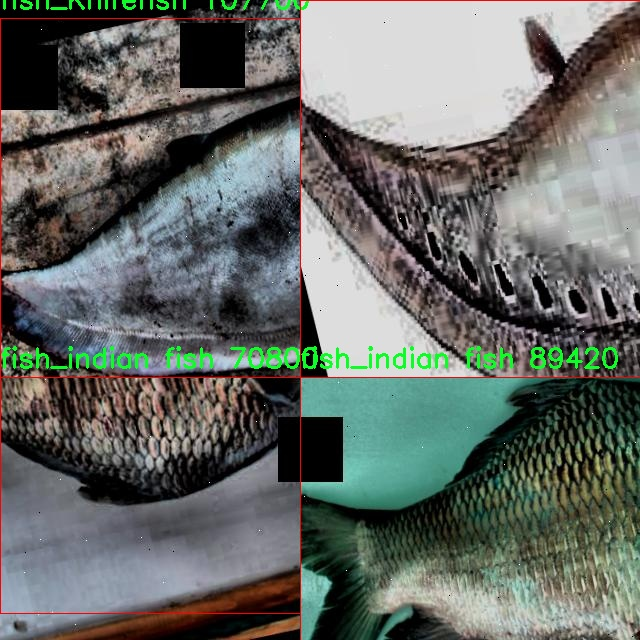

# 鱼类种类检测检测系统源码分享
 # [一条龙教学YOLOV8标注好的数据集一键训练_70+全套改进创新点发刊_Web前端展示]

### 1.研究背景与意义

项目参考[AAAI Association for the Advancement of Artificial Intelligence](https://gitee.com/qunshansj/projects)

项目来源[AACV Association for the Advancement of Computer Vision](https://gitee.com/qunmasj/projects)

研究背景与意义

随着全球水产养殖业的迅速发展，鱼类的种类检测与识别变得愈发重要。鱼类不仅是人类饮食中重要的蛋白质来源，同时也是生态系统中不可或缺的组成部分。准确识别鱼类种类对于渔业管理、生态保护以及水产养殖的可持续发展具有重要意义。然而，传统的鱼类识别方法往往依赖于人工观察和专家判断，效率低下且容易受到主观因素的影响。因此，基于计算机视觉的自动化鱼类种类检测系统应运而生，成为研究的热点。

近年来，深度学习技术的迅猛发展为物体检测领域带来了革命性的变化。其中，YOLO（You Only Look Once）系列模型因其高效的实时检测能力而广泛应用于各类物体识别任务。YOLOv8作为该系列的最新版本，结合了更为先进的网络结构和训练策略，能够在保证检测精度的同时显著提高处理速度。然而，尽管YOLOv8在多种物体检测任务中表现出色，但在特定领域如鱼类种类检测中，仍存在一定的挑战。鱼类的外观差异往往较小，且在水下环境中光线和背景复杂，这对模型的准确性提出了更高的要求。因此，改进YOLOv8以适应鱼类种类检测的特定需求，成为本研究的重要目标。

本研究将基于一个包含1500张图像和20种鱼类的多样化数据集，探索如何通过改进YOLOv8模型来提升鱼类种类检测的性能。数据集中涵盖了多种鱼类，如Bangus、Catfish、Grass Carp等，具有较高的代表性和实用性。通过对数据集的深入分析和模型的针对性改进，期望能够提高模型在复杂水下环境中的识别准确率和鲁棒性。此外，研究还将探讨数据增强、迁移学习等技术在鱼类种类检测中的应用，以进一步提升模型的泛化能力。

本研究的意义不仅在于推动鱼类种类检测技术的发展，更在于为水产养殖和生态保护提供科学依据。通过构建高效的鱼类种类检测系统，能够为渔业管理者提供实时监测工具，帮助其制定科学的捕捞和养殖策略，进而促进水产资源的可持续利用。同时，准确的鱼类识别也有助于生态学研究，特别是在生物多样性监测和生态系统健康评估方面，能够为相关政策的制定提供数据支持。

综上所述，基于改进YOLOv8的鱼类种类检测系统的研究，不仅具有重要的学术价值，也为实际应用提供了可行的解决方案，推动了水产养殖和生态保护领域的进步。通过这一研究，期望能够为鱼类种类检测技术的发展贡献新的思路和方法，促进水产资源的可持续管理与保护。

### 2.图片演示


##### 注意：由于此博客编辑较早，上面“2.图片演示”和“3.视频演示”展示的系统图片或者视频可能为老版本，新版本在老版本的基础上升级如下：（实际效果以升级的新版本为准）

  （1）适配了YOLOV8的“目标检测”模型和“实例分割”模型，通过加载相应的权重（.pt）文件即可自适应加载模型。

  （2）支持“图片识别”、“视频识别”、“摄像头实时识别”三种识别模式。

  （3）支持“图片识别”、“视频识别”、“摄像头实时识别”三种识别结果保存导出，解决手动导出（容易卡顿出现爆内存）存在的问题，识别完自动保存结果并导出到tempDir中。

  （4）支持Web前端系统中的标题、背景图等自定义修改，后面提供修改教程。

  另外本项目提供训练的数据集和训练教程,暂不提供权重文件（best.pt）,需要您按照教程进行训练后实现图片演示和Web前端界面演示的效果。

### 3.视频演示

[3.1 视频演示](https://www.bilibili.com/video/BV114tLemEXR/)

### 4.数据集信息展示

##### 4.1 本项目数据集详细数据（类别数＆类别名）

nc: 7
names: ['fish_Goby', 'fish_Indo-Pacific Tarpon', 'fish_Jaguar Gapote', 'fish_Janitor Fish', 'fish_Knifefish', 'fish_Long-Snouted Pipefish', 'fish_indian fish']


##### 4.2 本项目数据集信息介绍

数据集信息展示

在本研究中，我们使用了名为“I, J, K types of fish”的数据集，以训练和改进YOLOv8模型，旨在提高鱼类种类检测系统的准确性和效率。该数据集包含了七种不同类型的鱼类，具体类别包括：鱼类戈比（fish_Goby）、印太鲹（fish_Indo-Pacific Tarpon）、美洲豹间隙鱼（fish_Jaguar Gapote）、清洁鱼（fish_Janitor Fish）、刀鱼（fish_Knifefish）、长嘴管鱼（fish_Long-Snouted Pipefish）以及印度鱼（fish_indian fish）。这些鱼类的选择不仅丰富了数据集的多样性，也为模型的训练提供了广泛的应用场景。

数据集的构建过程中，研究团队对每种鱼类进行了精心的标注和分类，确保了数据的准确性和可靠性。每个类别的样本数量经过严格筛选，以保证模型在训练过程中能够获得足够的特征信息，从而提高其在实际应用中的表现。鱼类戈比作为一种常见的淡水鱼，因其独特的体型和颜色而被广泛研究；印太鲹则是热带和亚热带水域中的重要经济鱼类，具有较高的商业价值；美洲豹间隙鱼以其鲜艳的色彩和独特的斑纹而受到关注；清洁鱼在生态系统中扮演着重要角色，能够清除其他鱼类身上的寄生虫；刀鱼因其独特的外形和生境而备受研究者的青睐；长嘴管鱼则以其细长的身体和特殊的捕食方式而著称；而印度鱼则是一个相对较少被研究的物种，因其独特的生物特性而引起了我们的兴趣。

数据集的图像质量和多样性也是其重要特点之一。所有图像均经过高分辨率拍摄，确保了细节的清晰可辨。这些图像不仅涵盖了不同的光照条件和背景环境，还包括了鱼类在自然栖息地中的多种姿态和行为。这种多样性使得YOLOv8模型在训练过程中能够学习到更为丰富的特征，从而提高其在实际应用中的泛化能力。

在数据集的使用过程中，我们采用了数据增强技术，以进一步提高模型的鲁棒性。通过对图像进行旋转、缩放、翻转和颜色调整等操作，我们能够生成更多的训练样本，帮助模型更好地适应不同的环境和条件。这一过程不仅提升了模型的学习效率，也增强了其在实际应用中的适应能力。

总之，“I, J, K types of fish”数据集为本研究提供了一个坚实的基础，涵盖了丰富的鱼类种类和多样的图像特征。通过对该数据集的深入分析和利用，我们期望能够显著提升YOLOv8模型在鱼类种类检测中的表现，为未来的生态研究和渔业管理提供更为有效的技术支持。




### 5.全套项目环境部署视频教程（零基础手把手教学）

[5.1 环境部署教程链接（零基础手把手教学）](https://www.ixigua.com/7404473917358506534?logTag=c807d0cbc21c0ef59de5)


[5.2 安装Python虚拟环境创建和依赖库安装视频教程链接（零基础手把手教学）](https://www.ixigua.com/7404474678003106304?logTag=1f1041108cd1f708b01a)

### 6.手把手YOLOV8训练视频教程（零基础小白有手就能学会）

[6.1 手把手YOLOV8训练视频教程（零基础小白有手就能学会）](https://www.ixigua.com/7404477157818401292?logTag=d31a2dfd1983c9668658)

### 7.70+种全套YOLOV8创新点代码加载调参视频教程（一键加载写好的改进模型的配置文件）

[7.1 70+种全套YOLOV8创新点代码加载调参视频教程（一键加载写好的改进模型的配置文件）](https://www.ixigua.com/7404478314661806627?logTag=29066f8288e3f4eea3a4)

### 8.70+种全套YOLOV8创新点原理讲解（非科班也可以轻松写刊发刊，V10版本正在科研待更新）

由于篇幅限制，每个创新点的具体原理讲解就不一一展开，具体见下列网址中的创新点对应子项目的技术原理博客网址【Blog】：


[8.1 70+种全套YOLOV8创新点原理讲解链接](https://gitee.com/qunmasj/good)

### 9.系统功能展示（检测对象为举例，实际内容以本项目数据集为准）

图9.1.系统支持检测结果表格显示

  图9.2.系统支持置信度和IOU阈值手动调节

  图9.3.系统支持自定义加载权重文件best.pt(需要你通过步骤5中训练获得)

  图9.4.系统支持摄像头实时识别

  图9.5.系统支持图片识别

  图9.6.系统支持视频识别

  图9.7.系统支持识别结果文件自动保存

  图9.8.系统支持Excel导出检测结果数据


### 10.原始YOLOV8算法原理

原始YOLOv8算法原理

YOLOv8算法是YOLO系列目标检测模型的最新进展，其设计理念是为了解决实时目标检测中的准确性和速度之间的平衡。与前几代YOLO模型相比，YOLOv8在网络结构和训练策略上进行了多项创新，旨在提高检测精度和效率。YOLOv8模型提供了多种尺寸的模型选项，包括n、s、m、l和x，用户可以根据具体应用场景的需求选择合适的模型。这些模型的设计不仅仅是简单的缩放，而是通过调整主干网络的通道数和深度，优化模型的性能。

YOLOv8的网络结构主要分为三个部分：输入端、主干网络和检测端。输入端负责对输入图像进行预处理，包括Mosaic数据增强、自适应图像缩放和灰度填充等，以提高模型的鲁棒性。主干网络采用了卷积和池化等操作，通过C2f模块提取图像特征。C2f模块的设计灵感来源于YOLOv5中的C3模块和YOLOv7中的ELAN模块，增加了更多的残差连接，从而使得模型在保持轻量化的同时，能够获得更丰富的梯度信息。这种设计使得YOLOv8在特征提取的过程中，能够更好地捕捉到图像中的细节信息。

在网络的Neck部分，YOLOv8依然采用了PAN-FPN结构，但在上采样部分的卷积结构被删除，这一改变使得网络的计算效率得到了提升。特征图的融合通过下采样和上采样的结合，能够有效地整合不同尺度的特征信息，为后续的目标检测提供了更为丰富的上下文信息。

YOLOv8的检测端采用了当前流行的解耦合头结构，将分类和回归任务分开处理。这种设计使得分类和定位任务可以独立优化，分别提取类别和位置特征，从而提高了模型的收敛速度和预测精度。此外，YOLOv8摒弃了传统的Anchor-Based方法，转而采用Anchor-Free策略，直接预测目标的中心位置，这一改变在复杂背景下的目标检测中表现出了更高的精度。

在训练过程中，YOLOv8引入了动态的Task-Aligned Assigner样本分配策略，以优化正负样本的匹配。通过对分类分数和回归分数进行加权，YOLOv8能够更有效地进行样本的选择，从而提升模型的学习效率。在损失计算方面，YOLOv8使用了BCELoss作为分类损失，而回归损失则结合了DFLLoss和CIoULoss，这一组合能够更好地反映目标检测中的定位精度和分类准确性。

尽管YOLOv8在许多方面都进行了创新，但在复杂环境下，尤其是水面等背景复杂的场景中，仍然存在小目标检测的挑战。小目标的特征往往复杂且易受背景干扰，导致定位误差和目标感知能力不足。为了解决这些问题，研究者们提出了针对YOLOv8的改进方案，如YOLOv8-WSSOD算法，通过引入BiFormer双层路由注意力机制和更小的检测头，增强了模型对小目标的感知能力，并在Neck端引入GSConv和Slim-neck技术，以保持精度的同时降低计算量。

综上所述，YOLOv8算法通过多项创新，特别是在网络结构、样本分配和损失计算等方面的改进，显著提升了目标检测的精度和速度。其Anchor-Free的设计理念使得YOLOv8在处理复杂背景下的目标检测任务时，展现出了更强的适应性和鲁棒性。随着YOLOv8的不断发展和应用，其在实际场景中的表现将为目标检测领域带来更多的可能性和机遇。


### 11.项目核心源码讲解（再也不用担心看不懂代码逻辑）

#### 11.1 ui.py

以下是经过精简和注释的核心代码：

```python
import sys
import subprocess

def run_script(script_path):
    """
    使用当前 Python 环境运行指定的脚本。

    Args:
        script_path (str): 要运行的脚本路径
    """
    # 获取当前 Python 解释器的路径
    python_path = sys.executable

    # 构建运行命令，使用 streamlit 运行指定的脚本
    command = f'"{python_path}" -m streamlit run "{script_path}"'

    # 执行命令，并检查是否成功
    result = subprocess.run(command, shell=True)
    if result.returncode != 0:
        print("脚本运行出错。")

# 程序入口
if __name__ == "__main__":
    # 指定要运行的脚本路径
    script_path = "web.py"  # 这里可以直接指定脚本名称

    # 调用函数运行脚本
    run_script(script_path)
```

### 代码注释说明：
1. **导入模块**：
   - `sys`：用于获取当前 Python 解释器的路径。
   - `subprocess`：用于执行外部命令。

2. **`run_script` 函数**：
   - 功能：接收一个脚本路径，使用当前 Python 环境运行该脚本。
   - 参数：`script_path` 是要运行的脚本的路径。
   - 获取当前 Python 解释器的路径，构建运行命令。
   - 使用 `subprocess.run` 执行命令，并检查返回码以判断脚本是否成功运行。

3. **程序入口**：
   - 当脚本作为主程序运行时，指定要运行的脚本路径（这里是 `web.py`）。
   - 调用 `run_script` 函数来执行指定的脚本。

这个文件是一个 Python 脚本，主要功能是运行一个名为 `web.py` 的脚本。它通过调用当前 Python 环境中的 Streamlit 库来启动一个 Web 应用。文件的开头部分导入了必要的模块，包括 `sys`、`os` 和 `subprocess`，以及一个自定义的 `abs_path` 函数，这个函数用于获取文件的绝对路径。

在 `run_script` 函数中，首先获取当前 Python 解释器的路径，这样可以确保使用正确的 Python 环境来运行脚本。接着，构建一个命令字符串，该命令使用 `streamlit run` 来执行指定的脚本路径。然后，使用 `subprocess.run` 方法来执行这个命令。这个方法会在一个新的进程中运行命令，并且通过 `shell=True` 参数允许在 shell 中执行。

如果脚本运行出现错误，函数会检查返回的状态码，如果不等于 0，表示执行失败，程序会打印出“脚本运行出错。”的提示信息。

在文件的最后部分，使用 `if __name__ == "__main__":` 语句来确保只有在直接运行该脚本时才会执行后面的代码。在这里，首先调用 `abs_path` 函数获取 `web.py` 的绝对路径，然后调用 `run_script` 函数来运行这个脚本。

总的来说，这个脚本的作用是方便地启动一个 Streamlit Web 应用，确保在正确的 Python 环境中运行，并处理可能出现的错误。

#### 11.2 70+种YOLOv8算法改进源码大全和调试加载训练教程（非必要）\ultralytics\nn\extra_modules\block.py

以下是经过简化和注释的核心代码部分，保留了主要的类和函数，并对其进行了详细的中文注释：

```python
import torch
import torch.nn as nn
import torch.nn.functional as F

def autopad(k, p=None, d=1):
    """自动填充以保持输出形状相同。"""
    if d > 1:
        k = d * (k - 1) + 1 if isinstance(k, int) else [d * (x - 1) + 1 for x in k]  # 实际的卷积核大小
    if p is None:
        p = k // 2 if isinstance(k, int) else [x // 2 for x in k]  # 自动填充
    return p

class Conv(nn.Module):
    """卷积层，包含卷积、批归一化和激活函数。"""
    def __init__(self, in_channels, out_channels, kernel_size=3, stride=1, padding=None, groups=1, act=True):
        super().__init__()
        self.conv = nn.Conv2d(in_channels, out_channels, kernel_size, stride, autopad(kernel_size, padding), groups=groups, bias=False)
        self.bn = nn.BatchNorm2d(out_channels)
        self.act = nn.ReLU() if act else nn.Identity()

    def forward(self, x):
        return self.act(self.bn(self.conv(x)))

class Bottleneck(nn.Module):
    """标准瓶颈模块，包含两个卷积层。"""
    def __init__(self, c1, c2, shortcut=True, g=1, k=(3, 3), e=0.5):
        super().__init__()
        c_ = int(c2 * e)  # 隐藏通道数
        self.cv1 = Conv(c1, c_, k[0], 1)  # 第一个卷积层
        self.cv2 = Conv(c_, c2, k[1], 1, g=g)  # 第二个卷积层
        self.add = shortcut and c1 == c2  # 是否使用shortcut连接

    def forward(self, x):
        """前向传播，使用shortcut连接。"""
        return x + self.cv2(self.cv1(x)) if self.add else self.cv2(self.cv1(x))

class C3(nn.Module):
    """包含多个瓶颈模块的层。"""
    def __init__(self, c1, c2, n=1, shortcut=False, g=1, e=0.5):
        super().__init__()
        self.m = nn.Sequential(*(Bottleneck(c1, c2, shortcut, g, k=(3, 3), e=e) for _ in range(n)))

    def forward(self, x):
        """前向传播，依次通过所有瓶颈模块。"""
        return self.m(x)

class DyHeadBlock(nn.Module):
    """动态头块，使用不同的卷积和注意力机制。"""
    def __init__(self, in_channels, norm_type='GN'):
        super().__init__()
        self.spatial_conv = Conv(in_channels, in_channels)  # 空间卷积
        self.offset_conv = nn.Conv2d(in_channels, 3 * 3 * 3, 3, padding=1)  # 偏移卷积
        self.norm = nn.GroupNorm(16, in_channels) if norm_type == 'GN' else nn.BatchNorm2d(in_channels)

    def forward(self, x):
        """前向传播，计算偏移和卷积。"""
        offset = self.offset_conv(x)
        x = self.spatial_conv(x)
        return self.norm(x)

class Fusion(nn.Module):
    """融合模块，支持不同的融合方式。"""
    def __init__(self, inc_list):
        super().__init__()
        self.fusion_weight = nn.Parameter(torch.ones(len(inc_list), dtype=torch.float32), requires_grad=True)

    def forward(self, x):
        """前向传播，进行特征融合。"""
        fusion_weight = F.softmax(self.fusion_weight, dim=0)
        return sum(fusion_weight[i] * x[i] for i in range(len(x)))

# 其他模块和类可以根据需要继续添加
```

### 代码说明：
1. **autopad**: 用于自动计算卷积的填充，以保持输出形状与输入相同。
2. **Conv**: 自定义卷积层，包含卷积、批归一化和激活函数。
3. **Bottleneck**: 标准瓶颈模块，包含两个卷积层，支持shortcut连接。
4. **C3**: 由多个瓶颈模块组成的层。
5. **DyHeadBlock**: 动态头块，包含空间卷积和偏移卷积，计算特征图的偏移。
6. **Fusion**: 特征融合模块，支持加权融合。

该代码的核心部分保留了主要的功能和结构，适合进一步扩展和使用。

这个程序文件是一个用于YOLOv8算法改进的深度学习模块，主要实现了一系列神经网络层和结构，包括卷积层、注意力机制、残差连接等。文件中包含了多个类和函数，以下是对主要部分的说明。

首先，文件导入了必要的库，包括PyTorch、NumPy以及一些自定义模块。这些模块提供了构建卷积层、注意力机制和其他深度学习组件所需的功能。

文件的核心部分是定义了一系列的神经网络模块。`__all__`列表中列出了所有可供外部调用的类和函数，确保了模块的封装性和可维护性。

在类的定义中，`autopad`函数用于自动计算卷积层的填充，以保持输出尺寸与输入尺寸一致。接下来的类定义中，`DyHeadBlock`和`DyHeadBlockWithDCNV3`是动态头部块的实现，利用动态卷积和注意力机制来增强特征提取能力。

`Fusion`类实现了特征融合的不同方法，如加权、适应性融合和连接等。`Partial_conv3`和`Faster_Block`则实现了更高效的卷积操作和特征混合。

`C3_Faster`和`C2f_Faster`等类是对YOLOv8中基本结构的扩展，使用了更复杂的卷积和注意力机制来提高模型的性能。

`ContextGuidedBlock`和`MSBlock`等类则实现了上下文引导和多尺度特征提取的功能，进一步增强了模型对不同特征的学习能力。

文件中还实现了一些特定的注意力机制，如`FocusedLinearAttention`和`RFAConv`，这些机制通过加权特征图来提升模型的表现。

最后，文件中定义的`Bottleneck`类和其衍生类（如`Bottleneck_ODConv`、`Bottleneck_RFAConv`等）是实现残差连接的基础，允许在网络中构建更深的结构而不会导致梯度消失。

总的来说，这个程序文件实现了YOLOv8算法中的多种改进模块，旨在通过复杂的卷积结构和注意力机制来提高目标检测的精度和效率。每个模块都经过精心设计，以便在不同的任务中灵活应用。

#### 11.3 70+种YOLOv8算法改进源码大全和调试加载训练教程（非必要）\ultralytics\models\yolo\pose\train.py

以下是代码中最核心的部分，并附上详细的中文注释：

```python
# 导入必要的库和模块
from copy import copy
from ultralytics.models import yolo
from ultralytics.nn.tasks import PoseModel
from ultralytics.utils import DEFAULT_CFG, LOGGER
from ultralytics.utils.plotting import plot_images, plot_results

class PoseTrainer(yolo.detect.DetectionTrainer):
    """
    PoseTrainer类扩展了DetectionTrainer类，用于基于姿态模型的训练。
    """

    def __init__(self, cfg=DEFAULT_CFG, overrides=None, _callbacks=None):
        """初始化PoseTrainer对象，使用指定的配置和覆盖参数。"""
        if overrides is None:
            overrides = {}
        overrides['task'] = 'pose'  # 设置任务类型为姿态估计
        super().__init__(cfg, overrides, _callbacks)  # 调用父类构造函数

        # 检查设备类型，如果是Apple MPS，给出警告
        if isinstance(self.args.device, str) and self.args.device.lower() == 'mps':
            LOGGER.warning("WARNING ⚠️ Apple MPS known Pose bug. Recommend 'device=cpu' for Pose models. "
                           'See https://github.com/ultralytics/ultralytics/issues/4031.')

    def get_model(self, cfg=None, weights=None, verbose=True):
        """获取指定配置和权重的姿态估计模型。"""
        # 创建PoseModel实例
        model = PoseModel(cfg, ch=3, nc=self.data['nc'], data_kpt_shape=self.data['kpt_shape'], verbose=verbose)
        if weights:
            model.load(weights)  # 如果提供了权重，则加载权重

        return model  # 返回模型

    def set_model_attributes(self):
        """设置PoseModel的关键点形状属性。"""
        super().set_model_attributes()  # 调用父类的方法
        self.model.kpt_shape = self.data['kpt_shape']  # 设置关键点形状

    def get_validator(self):
        """返回PoseValidator类的实例以进行验证。"""
        self.loss_names = 'box_loss', 'pose_loss', 'kobj_loss', 'cls_loss', 'dfl_loss'  # 定义损失名称
        return yolo.pose.PoseValidator(self.test_loader, save_dir=self.save_dir, args=copy(self.args))  # 返回验证器实例

    def plot_training_samples(self, batch, ni):
        """绘制一批训练样本，包括注释的类别标签、边界框和关键点。"""
        images = batch['img']  # 获取图像
        kpts = batch['keypoints']  # 获取关键点
        cls = batch['cls'].squeeze(-1)  # 获取类别
        bboxes = batch['bboxes']  # 获取边界框
        paths = batch['im_file']  # 获取图像文件路径
        batch_idx = batch['batch_idx']  # 获取批次索引
        
        # 绘制图像并保存
        plot_images(images,
                    batch_idx,
                    cls,
                    bboxes,
                    kpts=kpts,
                    paths=paths,
                    fname=self.save_dir / f'train_batch{ni}.jpg',
                    on_plot=self.on_plot)

    def plot_metrics(self):
        """绘制训练和验证指标。"""
        plot_results(file=self.csv, pose=True, on_plot=self.on_plot)  # 保存结果图像
```

### 代码核心部分说明：
1. **PoseTrainer类**：继承自`DetectionTrainer`，用于处理姿态估计的训练任务。
2. **初始化方法**：设置任务类型为姿态估计，并处理设备类型的警告。
3. **获取模型**：创建和加载姿态估计模型。
4. **设置模型属性**：配置模型的关键点形状。
5. **获取验证器**：返回用于验证的PoseValidator实例。
6. **绘制训练样本**：可视化训练数据，包括图像、关键点和边界框。
7. **绘制指标**：可视化训练和验证过程中的指标结果。

该程序文件是一个用于训练基于姿态模型的YOLOv8算法的Python脚本，文件名为`train.py`，属于Ultralytics YOLO框架的一部分。文件中定义了一个名为`PoseTrainer`的类，该类继承自`DetectionTrainer`，用于实现姿态估计的训练过程。

在类的构造函数`__init__`中，首先初始化了一个`PoseTrainer`对象，并根据传入的配置和覆盖参数进行设置。如果没有提供覆盖参数，则使用一个空字典。此处将任务类型设置为“pose”，以指示该训练器将用于姿态估计模型的训练。此外，代码中还包含了对Apple MPS设备的警告，提示用户在使用姿态模型时推荐使用CPU，以避免已知的bug。

`get_model`方法用于获取姿态估计模型。该方法接收配置和权重参数，创建一个`PoseModel`实例，并在提供权重的情况下加载相应的权重。返回的模型将用于后续的训练过程。

`set_model_attributes`方法用于设置模型的关键点形状属性，确保模型的关键点形状与数据集中的关键点形状一致。

`get_validator`方法返回一个`PoseValidator`实例，用于在训练过程中进行验证。该方法定义了损失名称，包括边界框损失、姿态损失、关键对象损失、类别损失和分布损失，以便在训练和验证过程中进行监控。

`plot_training_samples`方法用于绘制一批训练样本的图像，包括标注的类别标签、边界框和关键点。该方法从输入的批次中提取图像、关键点、类别和边界框信息，并调用`plot_images`函数生成带有这些信息的图像，最后将结果保存到指定的目录中。

`plot_metrics`方法用于绘制训练和验证过程中的指标，调用`plot_results`函数生成相应的图表，并保存结果。

总体而言，该文件提供了一个结构化的方式来训练YOLOv8姿态估计模型，涵盖了模型的初始化、训练样本的可视化以及训练过程中的性能监控等功能。

#### 11.4 70+种YOLOv8算法改进源码大全和调试加载训练教程（非必要）\ultralytics\trackers\track.py

以下是代码中最核心的部分，并附上详细的中文注释：

```python
# 导入必要的库
from functools import partial
import torch
from ultralytics.utils import IterableSimpleNamespace, yaml_load
from ultralytics.utils.checks import check_yaml
from .bot_sort import BOTSORT
from .byte_tracker import BYTETracker

# 定义跟踪器映射字典
TRACKER_MAP = {'bytetrack': BYTETracker, 'botsort': BOTSORT}

def on_predict_start(predictor, persist=False):
    """
    在预测开始时初始化对象跟踪器。

    参数:
        predictor (object): 要为其初始化跟踪器的预测器对象。
        persist (bool, optional): 如果跟踪器已经存在，是否保持其状态。默认为 False。

    异常:
        AssertionError: 如果 tracker_type 不是 'bytetrack' 或 'botsort'。
    """
    # 如果预测器已经有跟踪器并且选择保持状态，则直接返回
    if hasattr(predictor, 'trackers') and persist:
        return
    
    # 检查并加载跟踪器的配置文件
    tracker = check_yaml(predictor.args.tracker)
    cfg = IterableSimpleNamespace(**yaml_load(tracker))
    
    # 确保跟踪器类型是支持的类型
    assert cfg.tracker_type in ['bytetrack', 'botsort'], \
        f"仅支持 'bytetrack' 和 'botsort'，但得到了 '{cfg.tracker_type}'"
    
    # 初始化跟踪器列表
    trackers = []
    for _ in range(predictor.dataset.bs):
        # 根据配置创建相应的跟踪器实例
        tracker = TRACKER_MAP[cfg.tracker_type](args=cfg, frame_rate=30)
        trackers.append(tracker)
    
    # 将跟踪器列表赋值给预测器
    predictor.trackers = trackers

def on_predict_postprocess_end(predictor):
    """后处理检测到的框并更新对象跟踪。"""
    bs = predictor.dataset.bs  # 批次大小
    im0s = predictor.batch[1]  # 获取原始图像
    for i in range(bs):
        det = predictor.results[i].boxes.cpu().numpy()  # 获取检测结果
        if len(det) == 0:  # 如果没有检测到物体，跳过
            continue
        
        # 更新跟踪器并获取跟踪结果
        tracks = predictor.trackers[i].update(det, im0s[i])
        if len(tracks) == 0:  # 如果没有跟踪到物体，跳过
            continue
        
        idx = tracks[:, -1].astype(int)  # 获取有效的索引
        predictor.results[i] = predictor.results[i][idx]  # 更新检测结果
        predictor.results[i].update(boxes=torch.as_tensor(tracks[:, :-1]))  # 更新框信息

def register_tracker(model, persist):
    """
    为模型注册跟踪回调，以便在预测期间进行对象跟踪。

    参数:
        model (object): 要为其注册跟踪回调的模型对象。
        persist (bool): 如果跟踪器已经存在，是否保持其状态。
    """
    # 注册预测开始时的回调
    model.add_callback('on_predict_start', partial(on_predict_start, persist=persist))
    # 注册预测后处理结束时的回调
    model.add_callback('on_predict_postprocess_end', on_predict_postprocess_end)
```

### 代码说明：
1. **导入模块**：导入了必要的库和工具，包括跟踪器的实现。
2. **跟踪器映射**：定义了一个字典，用于将跟踪器名称映射到具体的跟踪器类。
3. **`on_predict_start` 函数**：在预测开始时初始化跟踪器。检查配置文件，确保跟踪器类型有效，并为每个批次创建相应的跟踪器实例。
4. **`on_predict_postprocess_end` 函数**：在预测后处理阶段，更新检测结果并与跟踪器的输出进行整合，确保最终的检测结果包含跟踪信息。
5. **`register_tracker` 函数**：为模型注册回调函数，以便在预测的不同阶段执行相应的跟踪操作。

这段代码是一个用于YOLO（You Only Look Once）目标检测算法的跟踪器实现，主要用于在预测过程中对检测到的目标进行跟踪。代码中包含了一些重要的功能和步骤。

首先，代码导入了一些必要的库和模块，包括`torch`用于深度学习操作，以及`ultralytics`中的一些工具函数和类。这些工具函数和类帮助处理配置文件和检查。

接下来，定义了一个`TRACKER_MAP`字典，用于将跟踪器的名称映射到相应的跟踪器类（`BYTETracker`和`BOTSORT`）。这使得在代码中可以根据配置动态选择使用哪种跟踪器。

`on_predict_start`函数用于在预测开始时初始化跟踪器。它接收一个预测器对象和一个可选的持久化参数。如果预测器已经有跟踪器并且持久化为真，则直接返回。否则，它会检查配置文件中指定的跟踪器类型，并确保只支持`bytetrack`和`botsort`这两种类型。接着，根据批量大小（`bs`）创建相应数量的跟踪器实例，并将它们存储在预测器的`trackers`属性中。

`on_predict_postprocess_end`函数在预测后处理结束时被调用，用于更新检测到的目标框并进行对象跟踪。它首先获取批量大小和输入图像，然后对每个样本进行处理。如果检测到的目标框为空，则跳过该样本。否则，调用相应的跟踪器更新检测结果，并根据跟踪结果更新预测器的结果。

最后，`register_tracker`函数用于将跟踪回调注册到模型中，以便在预测过程中进行对象跟踪。它将`on_predict_start`和`on_predict_postprocess_end`两个函数作为回调函数添加到模型中，确保在预测开始和结束时能够正确地初始化和更新跟踪器。

整体来看，这段代码的主要功能是为YOLO目标检测模型提供一个灵活的跟踪机制，能够在检测到目标后对其进行持续跟踪，提升目标检测的准确性和稳定性。

#### 11.5 70+种YOLOv8算法改进源码大全和调试加载训练教程（非必要）\ultralytics\nn\modules\head.py

以下是代码中最核心的部分，并附上详细的中文注释：

```python
import torch
import torch.nn as nn

class Detect(nn.Module):
    """YOLOv8 检测头，用于目标检测模型。"""
    
    def __init__(self, nc=80, ch=()):
        """初始化 YOLOv8 检测层，指定类别数和通道数。
        
        参数:
        nc (int): 类别数量，默认为 80。
        ch (tuple): 输入通道数的元组。
        """
        super().__init__()
        self.nc = nc  # 类别数量
        self.nl = len(ch)  # 检测层的数量
        self.reg_max = 16  # DFL 通道数
        self.no = nc + self.reg_max * 4  # 每个锚点的输出数量
        self.stride = torch.zeros(self.nl)  # 在构建时计算的步幅
        c2, c3 = max((16, ch[0] // 4, self.reg_max * 4)), max(ch[0], min(self.nc, 100))  # 通道数
        # cv2 和 cv3 是用于生成边界框和类别概率的卷积层
        self.cv2 = nn.ModuleList(
            nn.Sequential(Conv(x, c2, 3), Conv(c2, c2, 3), nn.Conv2d(c2, 4 * self.reg_max, 1)) for x in ch)
        self.cv3 = nn.ModuleList(nn.Sequential(Conv(x, c3, 3), Conv(c3, c3, 3), nn.Conv2d(c3, self.nc, 1)) for x in ch)
        self.dfl = DFL(self.reg_max) if self.reg_max > 1 else nn.Identity()  # DFL 层

    def forward(self, x):
        """连接并返回预测的边界框和类别概率。
        
        参数:
        x (list): 输入特征图的列表。
        
        返回:
        y (tensor): 包含边界框和类别概率的张量。
        """
        shape = x[0].shape  # 获取输入的形状 (B, C, H, W)
        for i in range(self.nl):
            # 将 cv2 和 cv3 的输出连接在一起
            x[i] = torch.cat((self.cv2[i](x[i]), self.cv3[i](x[i])), 1)
        
        # 如果是训练模式，直接返回特征图
        if self.training:
            return x
        
        # 动态锚点生成
        self.anchors, self.strides = (x.transpose(0, 1) for x in make_anchors(x, self.stride, 0.5))
        self.shape = shape

        # 将所有层的输出连接在一起
        x_cat = torch.cat([xi.view(shape[0], self.no, -1) for xi in x], 2)
        box, cls = x_cat.split((self.reg_max * 4, self.nc), 1)  # 分割边界框和类别概率
        dbox = dist2bbox(self.dfl(box), self.anchors.unsqueeze(0), xywh=True, dim=1) * self.strides  # 计算最终的边界框

        # 归一化边界框以适应图像大小
        img_h = shape[2] * self.stride[0]
        img_w = shape[3] * self.stride[0]
        img_size = torch.tensor([img_w, img_h, img_w, img_h], device=dbox.device).reshape(1, 4, 1)
        dbox /= img_size  # 归一化

        # 返回边界框和类别概率
        y = torch.cat((dbox, cls.sigmoid()), 1)
        return y

# 其他类如 Segment, Pose, Classify 和 RTDETRDecoder 也可以类似地进行注释和简化
```

### 代码核心部分说明：
1. **Detect 类**：这是 YOLOv8 的检测头，负责处理输入特征图并生成边界框和类别概率。
2. **初始化方法**：设置类别数量、通道数、输出数量等参数，并定义卷积层以生成边界框和类别的特征。
3. **前向传播方法**：在前向传播中，连接各层的输出，生成锚点，并计算最终的边界框和类别概率。返回的结果包括边界框和经过 sigmoid 激活函数处理的类别概率。

其他类（如 Segment、Pose、Classify 和 RTDETRDecoder）可以采用类似的方式进行简化和注释。

这个程序文件是YOLOv8算法的一部分，主要定义了不同的模型头模块，包括检测、分割、姿态估计和分类等功能。文件中使用了PyTorch框架，包含了一些深度学习模型的构建和前向传播的实现。

首先，文件导入了一些必要的库和模块，包括数学库、PyTorch的神经网络模块、以及一些自定义的工具函数和模块。接着，定义了多个类，每个类代表一种特定的模型头。

`Detect`类是YOLOv8检测模型的核心部分，负责生成检测结果。它的构造函数初始化了类的属性，包括类别数量、检测层数、输出数量等。`forward`方法实现了前向传播过程，计算并返回预测的边界框和类别概率。在训练模式下，返回的是原始输出，而在推理模式下，会计算锚框和步幅，并进行后处理以得到最终的检测结果。

`Segment`类继承自`Detect`类，专门用于分割模型。它增加了处理掩膜的功能，能够输出掩膜系数和原型。在前向传播中，它会同时返回检测结果和掩膜系数。

`Pose`类同样继承自`Detect`类，主要用于姿态估计。它增加了关键点的处理，能够输出关键点的坐标。在前向传播中，它会返回检测结果和关键点的预测。

`Classify`类是YOLOv8的分类头，负责将输入图像分类到不同的类别。它通过卷积层、池化层和全连接层来实现分类功能。

最后，`RTDETRDecoder`类实现了一个实时可变形变换解码器，结合了变换器架构和可变形卷积，用于对象检测。它的构造函数初始化了多个参数，包括类别数量、隐藏层维度、查询数量等。`forward`方法处理输入并生成边界框和分类分数，支持训练和推理模式。

整个文件的设计思路是模块化和灵活性，允许用户根据不同的需求选择合适的模型头，适应多种计算机视觉任务。通过继承和组合不同的类，YOLOv8能够高效地处理检测、分割、姿态估计和分类等任务。

#### 11.6 train.py

以下是经过简化并添加详细中文注释的核心代码部分：

```python
import random
import numpy as np
import torch.nn as nn
from ultralytics.data import build_dataloader, build_yolo_dataset
from ultralytics.engine.trainer import BaseTrainer
from ultralytics.models import yolo
from ultralytics.nn.tasks import DetectionModel
from ultralytics.utils import LOGGER, RANK
from ultralytics.utils.torch_utils import de_parallel, torch_distributed_zero_first

class DetectionTrainer(BaseTrainer):
    """
    扩展自 BaseTrainer 类的检测模型训练类。
    """

    def build_dataset(self, img_path, mode="train", batch=None):
        """
        构建 YOLO 数据集。

        参数:
            img_path (str): 包含图像的文件夹路径。
            mode (str): 模式，`train` 表示训练模式，`val` 表示验证模式。
            batch (int, optional): 批次大小，适用于 `rect` 模式。默认为 None。
        """
        gs = max(int(de_parallel(self.model).stride.max() if self.model else 0), 32)
        return build_yolo_dataset(self.args, img_path, batch, self.data, mode=mode, rect=mode == "val", stride=gs)

    def get_dataloader(self, dataset_path, batch_size=16, rank=0, mode="train"):
        """构造并返回数据加载器。"""
        assert mode in ["train", "val"]
        with torch_distributed_zero_first(rank):  # 在分布式训练中，确保数据集只初始化一次
            dataset = self.build_dataset(dataset_path, mode, batch_size)
        shuffle = mode == "train"  # 训练模式下打乱数据
        workers = self.args.workers if mode == "train" else self.args.workers * 2
        return build_dataloader(dataset, batch_size, workers, shuffle, rank)  # 返回数据加载器

    def preprocess_batch(self, batch):
        """对图像批次进行预处理，包括缩放和转换为浮点数。"""
        batch["img"] = batch["img"].to(self.device, non_blocking=True).float() / 255  # 将图像转换为浮点数并归一化
        if self.args.multi_scale:  # 如果启用多尺度训练
            imgs = batch["img"]
            sz = (
                random.randrange(self.args.imgsz * 0.5, self.args.imgsz * 1.5 + self.stride)
                // self.stride
                * self.stride
            )  # 随机选择图像大小
            sf = sz / max(imgs.shape[2:])  # 计算缩放因子
            if sf != 1:
                ns = [
                    math.ceil(x * sf / self.stride) * self.stride for x in imgs.shape[2:]
                ]  # 计算新的图像形状
                imgs = nn.functional.interpolate(imgs, size=ns, mode="bilinear", align_corners=False)  # 调整图像大小
            batch["img"] = imgs
        return batch

    def get_model(self, cfg=None, weights=None, verbose=True):
        """返回 YOLO 检测模型。"""
        model = DetectionModel(cfg, nc=self.data["nc"], verbose=verbose and RANK == -1)  # 创建检测模型
        if weights:
            model.load(weights)  # 加载权重
        return model

    def plot_training_samples(self, batch, ni):
        """绘制训练样本及其注释。"""
        plot_images(
            images=batch["img"],
            batch_idx=batch["batch_idx"],
            cls=batch["cls"].squeeze(-1),
            bboxes=batch["bboxes"],
            paths=batch["im_file"],
            fname=self.save_dir / f"train_batch{ni}.jpg",
            on_plot=self.on_plot,
        )
```

### 代码说明：
1. **类 `DetectionTrainer`**：继承自 `BaseTrainer`，用于训练 YOLO 检测模型。
2. **`build_dataset` 方法**：根据给定的图像路径和模式构建数据集，支持训练和验证模式。
3. **`get_dataloader` 方法**：构造数据加载器，支持分布式训练，确保数据集只初始化一次。
4. **`preprocess_batch` 方法**：对输入的图像批次进行预处理，包括归一化和多尺度调整。
5. **`get_model` 方法**：返回一个 YOLO 检测模型，并可选择性地加载预训练权重。
6. **`plot_training_samples` 方法**：绘制训练样本及其对应的标签和边界框，便于可视化训练过程。

这个程序文件 `train.py` 是一个用于训练 YOLO（You Only Look Once）目标检测模型的实现，继承自 `BaseTrainer` 类。程序的主要功能是构建数据集、创建数据加载器、预处理图像、设置模型属性、获取模型、验证模型、记录损失、绘制训练样本和绘制训练指标等。

首先，程序导入了必要的库和模块，包括数学运算、随机数生成、深度学习框架 PyTorch 相关的模块，以及 Ultralytics 提供的各种工具和模型。接着定义了 `DetectionTrainer` 类，这个类专门用于基于检测模型的训练。

在 `build_dataset` 方法中，程序构建了 YOLO 数据集，接收图像路径、模式（训练或验证）和批量大小作为参数。该方法使用 `build_yolo_dataset` 函数来创建数据集，并根据模型的步幅（stride）设置图像的处理方式。

`get_dataloader` 方法则负责构建并返回数据加载器。它根据模式（训练或验证）来决定是否打乱数据，并设置工作线程的数量。使用 `torch_distributed_zero_first` 确保在分布式训练时只初始化一次数据集。

在 `preprocess_batch` 方法中，程序对图像批次进行预处理，包括将图像缩放到合适的大小并转换为浮点数。支持多尺度训练，通过随机选择图像大小来增强模型的鲁棒性。

`set_model_attributes` 方法用于设置模型的属性，包括类别数量和类别名称等，以确保模型能够正确处理数据集中的标签。

`get_model` 方法返回一个 YOLO 检测模型实例，如果提供了权重文件，则加载这些权重。`get_validator` 方法返回一个用于验证模型的验证器，记录损失值。

`label_loss_items` 方法用于返回带有标签的训练损失项字典，以便于后续的损失记录和分析。

`progress_string` 方法生成一个格式化的字符串，用于显示训练进度，包括当前的 epoch、GPU 内存使用情况、损失值、实例数量和图像大小等信息。

`plot_training_samples` 方法用于绘制训练样本及其标注，帮助可视化训练过程中的数据。`plot_metrics` 方法则从 CSV 文件中绘制训练指标，生成结果图像。最后，`plot_training_labels` 方法创建一个带标签的训练图，展示数据集中所有的边界框和类别信息。

总体来说，这个文件提供了一个完整的训练流程，涵盖了数据准备、模型构建、训练过程监控和结果可视化等多个方面，是 YOLO 模型训练的重要组成部分。

### 12.系统整体结构（节选）

### 整体功能和构架概括

该项目是一个基于YOLOv8算法的目标检测框架，旨在提供一个灵活且高效的工具集，用于目标检测、姿态估计、分割和分类等计算机视觉任务。项目的整体架构由多个模块组成，每个模块负责特定的功能，包括模型训练、数据处理、模型推理、可视化和性能评估等。通过将不同的功能模块化，用户可以根据需要选择和组合不同的组件，以实现自定义的目标检测解决方案。

以下是每个文件的功能整理表：

| 文件路径                                                                                               | 功能描述                                                                                                                                                   |
|--------------------------------------------------------------------------------------------------------|----------------------------------------------------------------------------------------------------------------------------------------------------------|
| `D:\tools\20240809\code\ui.py`                                                                        | 启动一个Streamlit Web应用，运行YOLOv8的Web界面，方便用户进行模型的可视化和交互操作。                                                                 |
| `D:\tools\20240809\code\70+种YOLOv8算法改进源码大全和调试加载训练教程（非必要）\ultralytics\nn\extra_modules\block.py` | 定义YOLOv8模型中的多种神经网络模块，包括卷积层、注意力机制和残差连接等，增强特征提取能力。                                                             |
| `D:\tools\20240809\code\70+种YOLOv8算法改进源码大全和调试加载训练教程（非必要）\ultralytics\models\yolo\pose\train.py` | 实现姿态估计模型的训练过程，包括数据集构建、模型初始化、验证和损失记录等功能。                                                                          |
| `D:\tools\20240809\code\70+种YOLOv8算法改进源码大全和调试加载训练教程（非必要）\ultralytics\trackers\track.py`   | 提供YOLO目标检测模型的跟踪功能，支持在检测后对目标进行持续跟踪，提升检测的准确性和稳定性。                                                             |
| `D:\tools\20240809\code\70+种YOLOv8算法改进源码大全和调试加载训练教程（非必要）\ultralytics\nn\modules\head.py`   | 定义YOLOv8模型的头部模块，包括检测、分割、姿态估计和分类等功能，负责生成最终的预测结果。                                                               |
| `D:\tools\20240809\code\train.py`                                                                     | 负责YOLO目标检测模型的训练流程，包括数据准备、模型构建、训练过程监控和结果可视化等功能。                                                              |
| `code\ultralytics\solutions\__init__.py`                                                             | 初始化Ultralytics解决方案模块，可能包含一些基础配置和模块导入。                                                                                       |
| `70+种YOLOv8算法改进源码大全和调试加载训练教程（非必要）\ultralytics\models\sam\modules\sam.py`            | 实现SAM（Segment Anything Model）模块，提供图像分割功能，支持多种分割任务。                                                                            |
| `code\ultralytics\models\yolo\classify\__init__.py`                                                 | 初始化YOLO分类模型模块，提供分类功能的实现。                                                                                                            |
| `70+种YOLOv8算法改进源码大全和调试加载训练教程（非必要）\ultralytics\nn\extra_modules\kernel_warehouse.py`  | 提供卷积核仓库功能，管理和优化卷积核的使用，提高模型的效率和性能。                                                                                     |
| `code\ultralytics\utils\benchmarks.py`                                                                | 提供基准测试工具，用于评估模型的性能和速度，帮助用户优化模型和训练过程。                                                                                |
| `code\ultralytics\models\yolo\segment\val.py`                                                        | 实现YOLO分割模型的验证过程，评估模型在分割任务上的表现。                                                                                               |
| `70+种YOLOv8算法改进源码大全和调试加载训练教程（非必要）\ultralytics\data\build.py`                     | 构建YOLO数据集，处理数据集的加载和预处理，确保数据能够正确输入到模型中进行训练和验证。                                                                |

以上表格概述了项目中各个文件的主要功能，展示了YOLOv8目标检测框架的模块化设计和灵活性。每个模块都承担特定的任务，协同工作以实现完整的目标检测解决方案。

注意：由于此博客编辑较早，上面“11.项目核心源码讲解（再也不用担心看不懂代码逻辑）”中部分代码可能会优化升级，仅供参考学习，完整“训练源码”、“Web前端界面”和“70+种创新点源码”以“13.完整训练+Web前端界面+70+种创新点源码、数据集获取”的内容为准。

### 13.完整训练+Web前端界面+70+种创新点源码、数据集获取


# [下载链接：https://mbd.pub/o/bread/ZpuWmZty](https://mbd.pub/o/bread/ZpuWmZty)